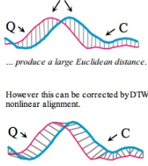

# 고혜선 강사님

**대학원 진학 시**

[연구분야 ]

-> 연구실 실적 확인 ( publication :  conference 확인 / genral 확인 )

CS 한정하여 Conference가 좋음

```
computer vision top conference -> rating 확인
```

->  교수님과의 케미 및 연구실 분위기

```
members list up 확인하였을 때 자대생 비율이 높은 곳이 좋은 곳...!

members중 누군가에게 contact 할 수 있음

좋게 말해줄지는 모른다 ~

연락할 거면 석사 탈출하는 사람한테 연락하는게 가장 친절할 확률이 높다ㅋㅋ
```

[면접질문]

코딩테스트 -> 기술면접(3시간) -> 인성면접

```
코딩테스트 : 백준, leetcode 등
* 스터디 : 일주일에 몇 문제씩 풀기 ! stack, queue DFS, BFS, 동적 계획, GREEDY, back tracking 중요

기술면접 : 화상면접
1 ) 1시간 : 논문, 연구경험, 프로젝트 / 이력서 기반
2 ) 이후 : 화상면접인데 손코딩(코랩 링크줌), list 정렬, quick정렬(10분) ??
 + 베이즈 정리, 식의 의미, 왜 알아야하는지
 + 정보이론 중 entropy , kr diversion , 식이 왜 이렇게 디자인 되었는지 
 + 머신러닝 vs 딥러닝
 + sorting은 100% 나오는데 quick정렬 ?  을 하라고하면 바로 짤 수 있어야함
 + 언제 그 정렬이 발생하고, 해결법은 무엇인지
 + binary  : log n의 개념 증명
 + 모르는거 모른다하고
 
 인성면접
 ice breaking , 이력서 중 특이한거 뭐 물어봄
 자기소개
 석사논문 설명
 인턴 때 했던 일 설명
 NLP 인데 왜 IR로 지원?
 
 + 짧게 말하는 연습
```


[ 코딩 테스트 ]

cracking the coding interview

백준

[ 대학원 ] 

http://gradschoolstory.net/ 

https://carpedm20.github.io/ 이 분의 cv 참고

[ 강의 ]

vision : http://cs231n.stanford.edu/

자연어 : http://web.stanford.edu/class/cs224n/

강화학습 : 

Reinforcement Learning: An Introduction 리차드 S. 서튼 과 앤드류 바르토의 책

https://www.youtube.com/channel/UCwkGvF7xKz2E0Lv-fZ9wv2g

머신러닝 : 단단한 머신러닝 ( 책 )

[ 프로젝트 ]

관련 자료 찾는 법 :

sentimental analysis archive 


-----

-----------

----

# 정민수 박사님

## 1 ) 이슈1 

data stream : 실시간으로 데이터가 쌓인다.

쌓인 데이터에 대해서 분석을 수행할 때 데이터를 메모리에 올려야한다.

초반엔 ok, 근데 시간이 지나면서 무한대의 데이터가 생성된다. 그리고 이 무한의 데이터를 어떻게 메모리에 올려서 분석을 할 것인가 

scaler meter로 수행

## 2 ) 이슈2 

데이터가 실시간으로 계속 쌓이는데 분석 요청 후의 real time query를 어떻게 가져갈 것인가


=> 실시간으로 데이터가 쌓인 뒤, 모델링 후 결과를 내야한다. 연산량이 매우크다 !! 

=> online pca 방법이 나옴 : 추가된 것만 업데이트하자.

 

---

## SVD

: 2차원 행렬에는 적용 가능하지만, 3차원은 못함

ex )

tensor라는 정육면체가 있으면 얘를 svd 처럼 이차원으로 나누어서 확장하여 사용

=> n차원에 대해 확장하여 사용 


## Graph 에서의 추천

node에  input을 넣었을 때, neighbor(추천)와 관계를 맺을까? 아닐까 ?

1 ) common neighbor를 갖고 친구를 추천해줄 수 있다.

2 ) adamic adar : https://neo4j.com/docs/graph-algorithms/current/labs-algorithms/adamic-adar/

누구나 follow하는 정보로서의 가치가 없다 -> 제거

follower 수가 많이 없는데 공통된 친구라면 -> 친구일 확률이 높음

진짜 친구로 생각되는 사람한테 가중치를 줘서 이를 counting하는 것

3 ) RWR : [http://www.incodom.kr/%EA%B8%B0%EA%B3%84%ED%95%99%EC%8A%B5/RWR_algorithm](http://www.incodom.kr/기계학습/RWR_algorithm)

나를 기준으로 주변에 각 node를 계속 보내다보면 어떤 값으로 수렴을 하게 된다.

그럼 좀 더 친밀도가 높은(간선 수가 짧은) 순으로 추천을 해준다.

어떤 기준 노드에서 시작하여 얼마나 연관이 되어있는지에 대해 파악한다.

ex ) 주변에서 변호사를 찾을 때

4 ) DTW : https://hamait.tistory.com/862

sensor1 ~ sensorT : 벡터가 생성이 되는데, 이 때 데이터가 모두 있다는 가정하에 코사인 유사도 / PCC 등을 이용하여 거리를 구할 수 있다.

하지만 보통 공정에서 이런 데이터를 구할 수 없음

길이가 다른 시계열의 유사도를 구하고자할 때 사용

곡선을 늘리고 / 줄이고 / 이동시키고 를 통해서 비슷한 시계열을 똑같게 맞춰줌

 

패턴을 고려하여 시간이 맞지 않을 때의 SIMULARITY를 구할 수 있다.


